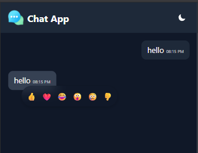
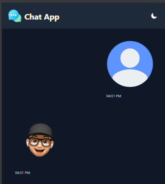
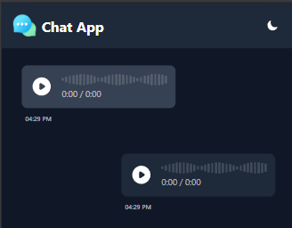
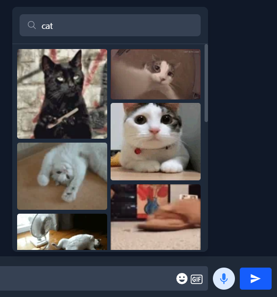

# 💬 Real-Time Chat App

A fully responsive, real-time chat application built with **React**, **Socket.IO**, and **Node.js**. Users can instantly connect to another random user and start chatting without any signup. This app supports text messages, file sharing, and even voice messages using WebRTC.

---

## 🚀 Features

- 🔗 **Real-Time Chat** — Instant messaging with Socket.IO
- 👥 **Random User Matching** — Connects you to a stranger without sign-up
- 📁 **File Sharing** — Send and receive images and other files instantly
- 🎙️ **Voice Messages** — Record and send audio messages
- 🌗 **Dark/Light Mode** — Toggle between light and dark themes
- 📱 **Responsive UI** — Works on both mobile and desktop
- 🧼 **Clean UI** — Simple and modern interface built with Tailwind CSS

---

## 📸 Preview










---

## 🛠 Tech Stack

**Frontend:**
- Next.js
- Tailwind CSS
- Socket.IO Client

**Backend:**
- Node.js
- Express.js
- Socket.IO Server

---

## 📦 Installation

### Clone the repository

```bash
git clone https://github.com/igamanraj/ChatApp-NextJS.git
cd ChatApp-NextJS
```

### Install dependencies

```bash
npm install
```
### Start the server

```bash
npm run dev
```

###### 🙌 Author
Built with ❤️ by "Aman"